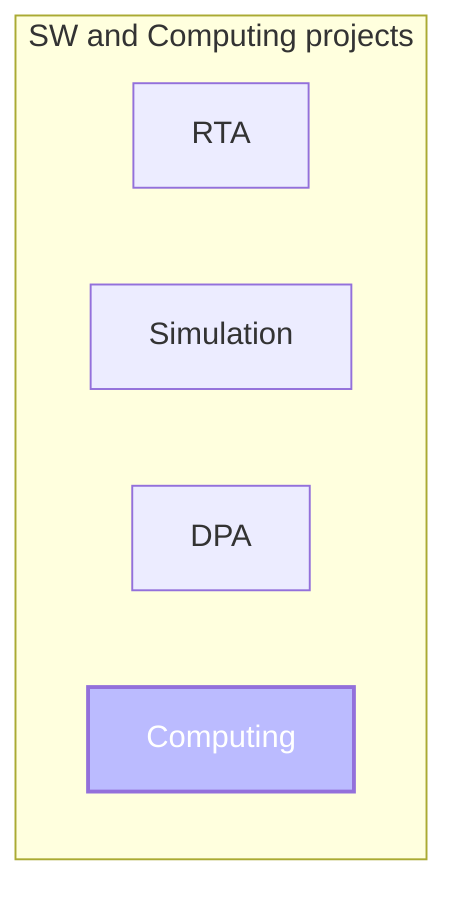
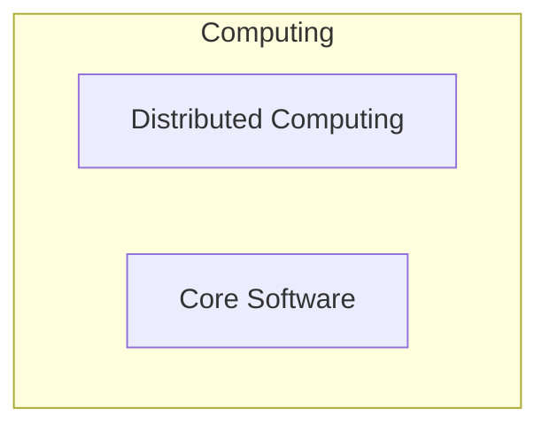
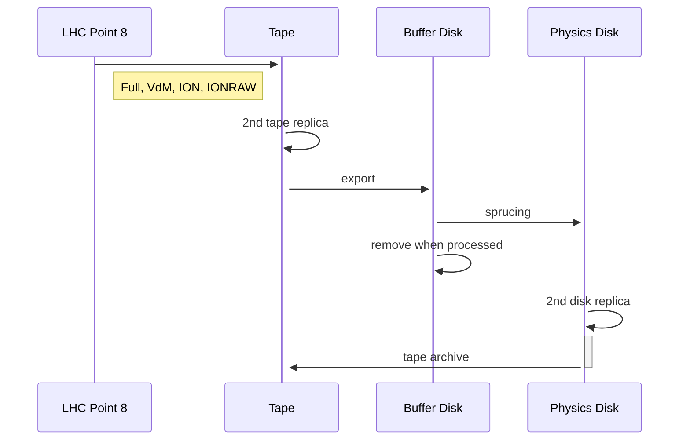
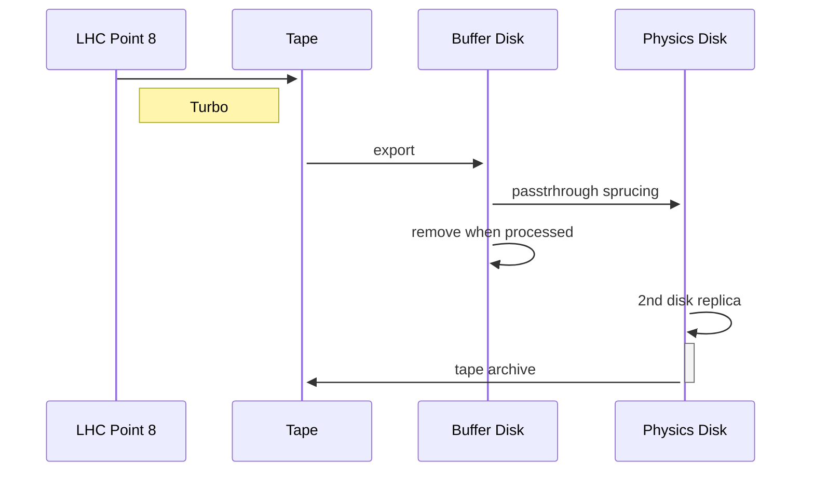
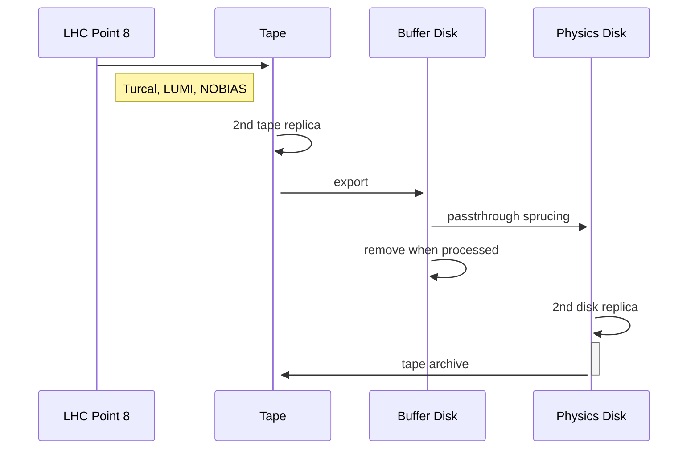
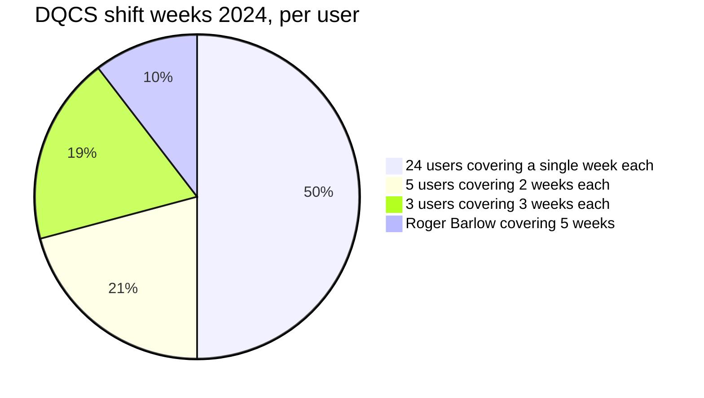

# Computing Operations

**Federico Stagni** <Email v="federico.stagni@cern.ch" />

January 16th 2025
__ <a href="https://indico.cern.ch/event/1447484/overview" class="ns-c-iconlink"><mdi-open-in-new />LHCb computing workshop 2025, A. Coruña</a>  

---
layout: top-title
color: gray-light
align: cm
title: why
---

:: title ::

# Why this presentation

:: content ::

- Shedding lights on LHCb organization for what regards software and computing
- Connecting few dots
- Making the community aware of the daily computing operations

---
layout: top-title-two-cols
color: gray-light
align: cm-lm-lm
title: SWAndComputing
columns: is-4
---

:: title ::

# SW and Computing projects

:: left ::

:: right ::

The coordination between the projects is done by the [LHCb Software and computing board](https://lhcb-scb.docs.cern.ch/)

<AdmonitionType type='info' >
With "computing" here we mean "offline" computing. This presentation explains the roles and the operations done "daily" for supporting the computing model.
</AdmonitionType>

---
layout: section
color: blue
title: CoreSW
---

# Core Software

---
layout: top-title
color: gray-light
align: cm
title: CSRoles
---

:: title ::

# Core Software: only fixed roles... for few people!

:: content ::

- **Maintenance and development** of
    - Gaudi (*Marco Clemencic*)
    - CI and Nightly Builds (*Marco Clemencic*)
    - user and developer environments, e.g. `lb-run` and `lb-dev` (*Marco Clemencic*, *Ben Couturier*)
- **Librarian** (*Ben Couturier*, *Marco Clemencic*)
    - software packaging and deployment
- **Liaison with SFT, ROOT, etc.** (*Ben Couturier*, *Marco Clemencic*)
- **LHCb frameworks support**
    - DD4hep (*Ben Couturier*, *Sebastien Ponce*)
    - adaptation to latest versions of Gaudi, ROOT etc. (*Marco Clemencic*, *Sebastien Ponce*)

---
layout: section
color: blue
title: DistributedComputing
---

# Distributed computing

---
layout: top-title-two-cols
color: gray-light
align: cm-cm-lm
title: BigPicture
columns: is-6
---

:: title ::

# Distributed computing: the big picture

:: left ::

:: right ::

Slightly adapted from the Computing Model TDR (mostly: more streams)

---
layout: top-title-two-cols
color: gray-light
align: cm-lt-lt
title: DCRoles
---

:: title ::

# Roles in distributed computing

:: left ::

## Fixed roles

- **Distributed computing coordinator** (*F. Stagni*)
- **Data Manager** -- currently one person (*C. Haen*) plus few helpers
- **Production Manager(s)** for preparation, submission, and follow-up
  - Montecarlo (*V. Romanovskiy*)
  - Real Data (mostly sprucing) (*Mark Slater*)
  - Analysis (*C. Burr*)
- **Site contacts** -- effectively Tier1 contacts

:: right ::

## Temporary roles

- **Grid expert** -- 1 expert every quarter
  - for 2025: 
    - *Concezio Bozzi*
    - *Alexander Rogovskiy*
    - *Henryk Giemza*
    - *Mark Slater*
- **DQCS shifters** -- 7 days shifts
  - currently about 60 people registered as DQCS shifters
  - refer to the Grid Expert for support

---
layout: iframe-left
title: DQCSDocs
url: https://lhcb-dqcs-docs.web.cern.ch
class: DQCSDocs
slide_info: false
color: gray-light
---

**Role**

<AdmonitionType type='info' >
What is on the left is https://lhcb-dqcs-docs.web.cern.ch
</AdmonitionType>

For 2024 and 2025, we will keep having

- **DQCS Shift** (what we talk about here), with duties:
  - Distributed Computing
  - MonteCarlo Simulation quality
- **DQCS (Offline DQ) Shift** with duty
  - Offline Data Quality

(ShiftDB is adapted to this split)

---
layout: top-title-two-cols
color: gray-light
align: cm-lm-lm
title: DQCS
---

:: title ::

# How to become a DQCS shifter

:: left ::

1. Search for DQCS in lms.cern.ch
2. Enrol, then follow Sub-Modules 2 and 3
3. Pass the exams for both!
4. Volunteer in lbshiftdb.cern.ch

:: right ::

**Stats from 2024**

and 2023 was similar

---
layout: top-title
color: gray-light
align: cm
title: Issues
---

:: title ::

# Issues

:: content ::

- **DQCS**: in 2024 30% of the shifts were covered by 4 people
- **DQCS**: in this beginning of 2025 we kept asking for last minute volunteers
- Our **Production Manager(s)** are one and only
  - We are slowly putting more and more automation
  - "Expert" support will always still be needed to adapt to evolving needs
    - Especially need application support from RTA/DPA/Core software

---
layout: top-title
color: gray-light
align: cm
title: Communications
---

:: title ::

# Communication channels 

:: content ::

- "Daily" (effectively Mon+Wed+Fri) Computing Operations meeting
  - 11:00 CERN time, hosted by the DQCS
- [Computing Operations mattermost channel](https://mattermost.web.cern.ch/lhcb/channels/computing-operations)
  - DQCS need to be part of it

---
layout: top-title
color: gray-light
align: cm
title: GridUsagePlots
---

:: title ::

# Grid Usage 

:: content ::

- More than 90% of CPU time is taken by MonteCarlo jobs
  - then, and now

---
layout: top-title
color: gray-light
align: cm
title: GridUsagePlotsSprucing
---

:: title ::

# Grid Usage / real data processing 

:: content ::

- Most of our operational time is dedicated to real data management
- Run3 represents a big step forward also for our distributed computing resources usage

---
layout: top-title
color: gray-light
align: cm
title: GridUsage
---

:: title ::

# Few points on Grid Usage 

:: content ::

- Pledged and opportunistic resources
  - With HLT farm being, by far, our biggest opportunistic resource
- All our disk and tape resources are pledged
  - But we are getting a "present" from Online
- In 2024 we faced a "disk crisis" that is making us thinking of changing the computing model
- 100% of the computing slots in use are `amd64`. We do have access to `arm64` slots but are unused. 
- Almost all the jobs submitted are single-core jobs. For the other WLCG experiments, it is the contrary.

---
layout: section
color: blue
title: Conclusions
---

# To conclude

---
layout: top-title-two-cols
align: cm-lm-lm
color: sky-light
title: summary
--- 
:: title ::

# Summary

:: left :: 

- The computing project takes care of distributed computing, and core software maintainance and development
- Mostly CERN-centric
- There is a large overlap between developers and operators of the system

:: right :: 

- A large fraction of "operations time" is driven by Real Data
- With the start of Run3 LHCb's numbers of Grid usage are similar to those of ATLAS and CMS
  - Operational scalability issues --> maintenance developments

---
layout: credits
color: indigo
loop: true
speed: 0.7
title: credits/people
---

    

        <strong>People</strong>  
    

    

        <strong>Currently involved in computing operations (excluding Tier1 contacts and DQCS shifters)</strong>
    

    

        Christophe Haen <i>Offline Data Manager, CERN</i> 
        Vladimir Romanovskiy <i>MC productions manager, Cincinnati (US)</i> 
        Mark Slater <i>Real data productions manager and GEOC, University of Birmingham (GB)</i> 
        Chris Burr <i>AP productions manager, CERN</i> 
        Henryk Giemza <i>T2 coordinator and GEOC, NCBJ (PL)</i> 
        Alexander Rogovskiy <i>Data Management and GEOC, STFC (UK)</i> 
        Concezio Bozzi <i>Offline resources coordinator and GEOC, INFN Ferrara (IT)</i> 
        M. Clemencic, S. Ponce and B. Couturier <i>Core Software operations, CERN</i> 
    

    

        <strong>Administration</strong>
    

    

        Ben Couturier <i>Software and Computing Coordinator, CERN</i> 
        Jan Van Eldik <i>Computing PL, CERN</i> 
        Federico Stagni <i>Computing PL deputy, CERN</i>
    

&nbsp;
&nbsp;
&nbsp;

    <strong>Questions?</strong>

